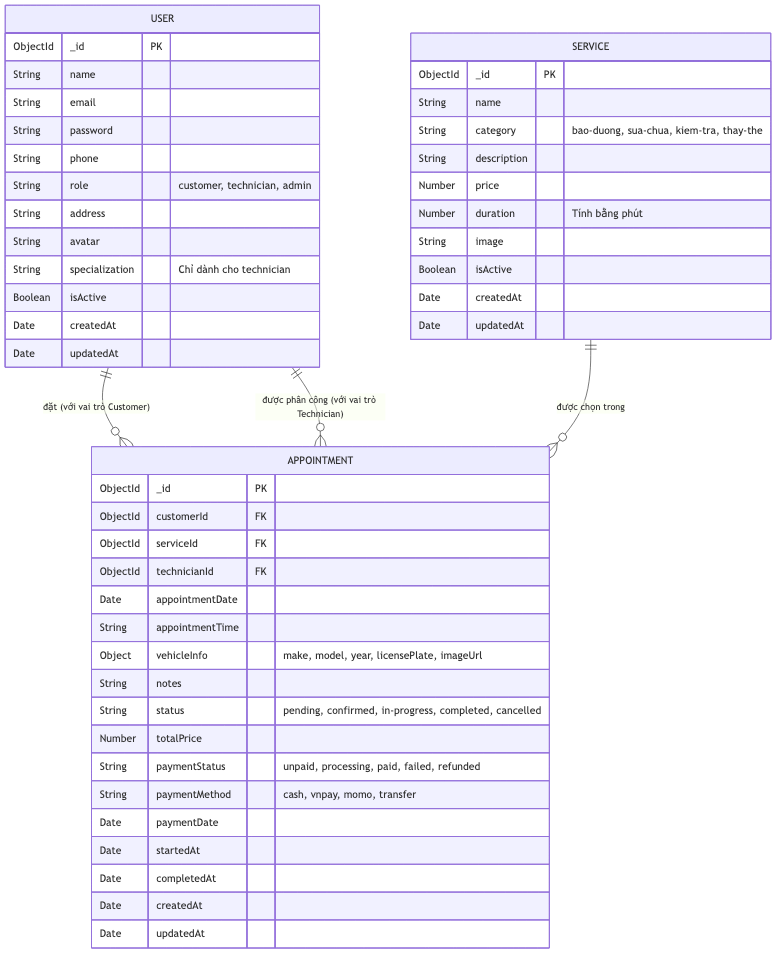

# Cấu Trúc Cơ Sở Dữ Liệu (ERD & Data Tables)

Dưới đây là tài liệu chi tiết về sơ đồ thực thể kết hợp (ERD) và cấu trúc các bảng dữ liệu (Collections) đang được sử dụng trong hệ thống AutoFix.

## 1. Sơ đồ Thực thể Kết hợp (ERD)

Sơ đồ thể hiện mối quan hệ giữa các Collection chính trong MongoDB:

---

## 2. Chi Tiết Các Bảng Dữ Liệu

### 2.1 Bảng `USERS` (Người dùng)
Lưu trữ toàn bộ thông tin tài khoản truy cập hệ thống. Phân quyền dựa trên cột `role`.

| Trường dữ liệu | Kiểu dữ liệu | Bắt buộc | Mô tả |
| :--- | :--- | :---: | :--- |
| `_id` | ObjectId | Có | Mã định danh duy nhất của MongoDB. |
| `name` | String | Có | Họ và tên người dùng (tối đa 100 ký tự). |
| `email` | String | Có | Địa chỉ email (duy nhất, dùng để đăng nhập). |
| `password` | String | Có | Mật khẩu (đã được băm bằng bcrypt). |
| `phone` | String | Có | Số điện thoại (chuẩn định dạng VN). |
| `role` | Enum | Có | Quyền hạn: `customer`, `technician`, `admin`. Mặc định: `customer`. |
| `address` | String | Không | Địa chỉ nơi ở hiện tại. |
| `avatar` | String | Không | Đường dẫn ảnh đại diện. |
| `specialization` | String | Không | Chuyên môn (VD: Động cơ, Điện). *Chỉ dùng cho Technician.* |
| `isActive` | Boolean | Không | Trạng thái hoạt động của tài khoản (Mặc định: `true`). |
| `createdAt` | Date | Tự động | Thời gian tạo tài khoản. |
| `updatedAt` | Date | Tự động | Thời gian cập nhật gần nhất. |

### 2.2 Bảng `SERVICES` (Danh mục Dịch vụ)
Lưu trữ thông tin các dịch vụ sửa chữa, bảo dưỡng mà xưởng cung cấp.

| Trường dữ liệu | Kiểu dữ liệu | Bắt buộc | Mô tả |
| :--- | :--- | :---: | :--- |
| `_id` | ObjectId | Có | Mã định danh duy nhất của dịch vụ. |
| `name` | String | Có | Tên dịch vụ (tối đa 200 ký tự). |
| `category` | Enum | Có | Danh mục: `bao-duong`, `sua-chua`, `kiem-tra`, `thay-the`. |
| `description` | String | Có | Mô tả chi tiết dịch vụ. |
| `price` | Number | Có | Mức giá dịch vụ (VNĐ). |
| `duration` | Number | Có | Thời gian dự kiến hoàn thành (tính bằng phút). |
| `image` | String | Không | Đường dẫn hình ảnh minh họa dịch vụ. |
| `isActive` | Boolean | Không | Trạng thái hiển thị (Mặc định: `true`). |

### 2.3 Bảng `APPOINTMENTS` (Lịch hẹn / Phiếu sửa chữa)
Bảng trung tâm của hệ thống, liên kết giữa Khách hàng, Kỹ thuật viên và Dịch vụ, ghi nhận tiến độ cũng như luồng thanh toán.

| Trường dữ liệu | Kiểu dữ liệu | Bắt buộc | Mô tả |
| :--- | :--- | :---: | :--- |
| `_id` | ObjectId | Có | Mã định danh duy nhất của lịch hẹn. |
| `customerId` | ObjectId (FK) | Có | Liên kết tới bảng `Users` (người đặt lịch). |
| `serviceId` | ObjectId (FK) | Có | Liên kết tới bảng `Services` (dịch vụ được đặt). |
| `technicianId` | ObjectId (FK) | Không | Liên kết tới `Users` (kỹ thuật viên được giao). |
| `appointmentDate` | Date | Có | Ngày khách hàng mang xe tới. |
| `appointmentTime` | String | Có | Giờ dự kiến (VD: "08:00", "14:30"). |
| `vehicleInfo` | Object | Có | Gồm: Hãng (`make`), Dòng xe (`model`), Năm (`year`), Biển số (`licensePlate`), và Ảnh xe (`imageUrl`). |
| `notes` | String | Không | Ghi chú thêm về triệu chứng của khách (tối đa 500 ký tự). |
| `status` | Enum | Có | Tiến độ: `pending`, `confirmed`, `in-progress`, `completed`, `cancelled`. |
| `totalPrice` | Number | Không | Tổng tiền thanh toán cho phiếu. |
| `paymentStatus`| Enum | Có | Trạng thái tiền: `unpaid`, `processing`, `paid`, `failed`, `refunded`. |
| `paymentMethod`| Enum | Có | Kiểu thanh toán: `cash`, `vnpay`, `momo`, `transfer`. |
| `paymentDate` | Date | Không | Thời gian thanh toán thành công. |
| `startedAt` | Date | Không | Thời gian kỹ thuật viên bắt đầu sửa xe thực tế. |
| `completedAt` | Date | Không | Thời gian kỹ thuật viên hoàn thành việc sửa chữa. |

---
**Lưu ý:**
- Các trường `status` và `paymentStatus` được tách riêng biệt để hỗ trợ tình huống Khách hàng có thể "Hoàn thành sửa chữa" nhưng chưa thanh toán ngay (Cho nợ) hoặc thanh toán online từ trước.
- Bảng `Appointments` đã được đánh Index tối ưu hóa truy vấn (`appointmentDate`, `customerId`) giúp việc hiển thị Dashboard và Lịch cho Technician cực kỳ nhanh chóng.
