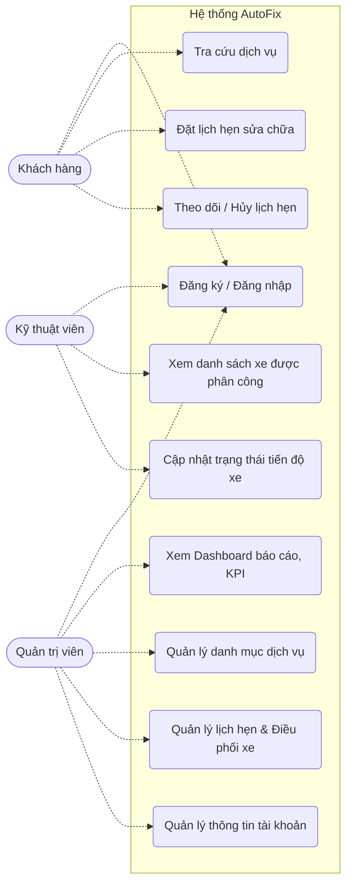

# Tài liệu Đặc tả Use Case - Hệ thống Đặt lịch Sửa chữa xe AutoFix

*Tài liệu này định nghĩa chi tiết các Tác nhân (Actors) và Đặc tả Use Case cho hệ thống AutoFix, phục vụ cho việc kiểm thử, phát triển và báo cáo dự án.*

---

## 1. Danh sách Tác nhân (Actors)

| STT | Tên Tác nhân | Vai trò trong hệ thống |
|:---:|:---|:---|
| **1** | **Khách hàng (Customer)** | Người sử dụng hệ thống để tra cứu danh mục dịch vụ sửa chữa/bảo dưỡng và đặt lịch hẹn cho xe ô tô của mình. |
| **2** | **Kỹ thuật viên (Technician)** | Nhân sự của xưởng/garage, chịu trách nhiệm tiếp nhận xe được Quản trị viên phân công, thực hiện sửa chữa và cập nhật tiến độ công việc. |
| **3** | **Quản trị viên (Admin)** | Người quản lý cấp cao nhất, điều hành toàn bộ hoạt động của hệ thống bao gồm: quản trị danh mục, nhân sự, điều phối lịch hẹn và theo dõi thống kê doanh thu. |
| **4** | **Hệ thống (System)** | Tác nhân ẩn, tự động xử lý các tác vụ nền như gửi email thông báo tự động (Nodemailer) khi có sự thay đổi về trạng thái lịch hẹn. |

---

## 2. Biểu đồ Use Case Tổng quan (Use Case Diagram)

---

## 3. Tổng hợp Danh sách Use Case (Use Case List)

Dưới đây là danh sách tổng hợp toàn bộ 14 Use Case của hệ thống, không phân chia lẻ theo từng tác nhân:

| Mã UC | Tên Use Case | Tác nhân (Actor) | Mức độ ưu tiên |
|:---:|---|---|:---:|
| UC-01 | Đăng ký tài khoản hệ thống | Khách hàng | Cao |
| UC-02 | Đăng nhập hệ thống (JWT) | Khách hàng, KTV, Admin | Cao |
| UC-03 | Quản lý thông tin tài khoản cá nhân | Khách hàng | Trung bình |
| UC-04 | Tìm kiếm và xem chi tiết danh mục dịch vụ | Khách hàng | Cao |
| UC-05 | Đặt lịch hẹn sửa chữa trực tuyến | Khách hàng | Rất cao |
| UC-06 | Theo dõi lịch sử đặt lịch và hóa đơn | Khách hàng | Cao |
| UC-07 | Hủy lịch hẹn sửa chữa (Trạng thái Pending) | Khách hàng | Trung bình |
| UC-08 | Xem lịch làm việc & danh sách xe được giao | Kỹ thuật viên | Cao |
| UC-09 | Cập nhật tiến độ sửa chữa xe | Kỹ thuật viên | Rất cao |
| UC-10 | Xem Dashboard thống kê (Biểu đồ, KPI) | Quản trị viên | Cao |
| UC-11 | Quản lý danh mục dịch vụ (Thêm, Sửa, Xóa) | Quản trị viên | Cao |
| UC-12 | Quản lý tổng lịch hẹn và duyệt lịch | Quản trị viên | Rất cao |
| UC-13 | Phân công Kỹ thuật viên phụ trách lịch hẹn | Quản trị viên | Rất cao |
| UC-14 | Quản lý hệ thống tài khoản người dùng | Quản trị viên | Trung bình |

---

## 4. Đặc tả Use Case Chi Tiết (Use Case Specifications)

Dưới đây là đặc tả chi tiết của toàn bộ 14 Use Case trong hệ thống.

### 4.1. Nhóm Use Case Khách Hàng

#### 👤 [UC-01] Đăng ký tài khoản hệ thống
- **Mô tả:** Khách hàng đăng ký tài khoản mới để sử dụng hệ thống.
- **Tiền điều kiện:** Người dùng chưa có tài khoản trên hệ thống.
- **Luồng sự kiện chính:**
  1. Người dùng truy cập vào trang Đăng ký (`/register`).
  2. Người dùng nhập các thông tin: Họ tên, Email, Số điện thoại, Mật khẩu.
  3. Người dùng bấm nút "Đăng ký".
  4. Hệ thống kiểm tra tính hợp lệ của dữ liệu và đảm bảo Email chưa tồn tại.
  5. Hệ thống mã hóa (hash) mật khẩu và lưu dữ liệu người dùng mới vào Database.
  6. Hệ thống điều hướng người dùng sang trang Đăng nhập.
- **Luồng ngoại lệ:** Nếu Email đã tồn tại, hệ thống báo lỗi "Email đã được sử dụng, vui lòng chọn email khác".

#### 🔑 [UC-02] Đăng nhập hệ thống (JWT)
- **Mô tả:** Người dùng (Khách hàng, KTV, Admin) đăng nhập vào hệ thống để bắt đầu phiên làm việc.
- **Tiền điều kiện:** Người dùng đã có tài khoản.
- **Luồng sự kiện chính:**
  1. Người dùng truy cập trang Đăng nhập (`/login`).
  2. Người dùng nhập Email và Mật khẩu.
  3. Hệ thống đối chiếu và xác thực thông tin với Database.
  4. Hệ thống khởi tạo và trả về một JWT (JSON Web Token) để lưu phiên đăng nhập ở local storage/cookie.
  5. Hệ thống tự động điều hướng người dùng dựa theo phân quyền `role` (Admin -> Dashboard, Khách -> Trang chủ, KTV -> Bảng công việc).
- **Luồng ngoại lệ:** Nếu sai mật khẩu hoặc tài khoản không tồn tại, hệ thống hiển thị cảnh báo "Sai thông tin đăng nhập".

#### 📝 [UC-03] Quản lý thông tin tài khoản cá nhân
- **Mô tả:** Khách hàng có thể cập nhật thông tin cá nhân của mình.
- **Tiền điều kiện:** Khách hàng đã đăng nhập.
- **Luồng sự kiện chính:**
  1. Khách hàng truy cập trang Hồ sơ cá nhân (`/profile`).
  2. Khách hàng tiến hành thay đổi các thông tin cơ bản: Họ tên, Số điện thoại.
  3. Khách hàng bấm nút "Cập nhật".
  4. Hệ thống lưu lại thông tin mới vào cơ sở dữ liệu và hiển thị thông báo thành công.

#### 🔍 [UC-04] Tìm kiếm và xem chi tiết danh mục dịch vụ
- **Mô tả:** Khách hàng tìm kiếm các dịch vụ sửa chữa và bảo dưỡng hiện có của xưởng.
- **Tiền điều kiện:** Không yêu cầu đăng nhập.
- **Luồng sự kiện chính:**
  1. Khách hàng truy cập trang Danh mục Dịch vụ (`/services`).
  2. Khách hàng gõ từ khóa vào thanh tìm kiếm, hoặc click chọn các tab phân loại (Bảo dưỡng, Sửa chữa, Kiểm tra, Thay thế).
  3. Hệ thống truy xuất Database và hiển thị danh sách các dịch vụ khớp với từ khóa/bộ lọc.
  4. Khách hàng có thể phân trang nếu danh sách dịch vụ quá dài.

#### 🚗 [UC-05] Đặt lịch hẹn sửa chữa trực tuyến
- **Mô tả:** Khách hàng chọn loại dịch vụ, chọn ngày giờ, và nhập thông tin phương tiện để đặt lịch hẹn với xưởng.
- **Tiền điều kiện:** Khách hàng đã đăng nhập vào hệ thống.
- **Luồng sự kiện chính:**
  1. Khách hàng truy cập vào trang Đặt lịch (`/booking`).
  2. Khách hàng chọn một hoặc nhiều dịch vụ cần thực hiện. Hệ thống tự động tính toán tổng thời gian và tổng chi phí ước tính (Hiển thị qua Summary Panel).
  3. Khách hàng chọn Ngày và Giờ muốn đem xe đến xưởng.
  4. Khách hàng điền thông tin chi tiết xe (Hãng xe, Dòng xe, Năm sản xuất, Biển số xe) và Ghi chú (nếu có).
  5. Khách hàng rà soát lại đơn và bấm nút "Xác nhận đặt lịch".
  6. Hệ thống tạo bản ghi vào Database với trạng thái mặc định là `Pending` (Đang chờ duyệt), cấp một mã lịch hẹn duy nhất (vd: `#AFX-XXXX`).
  7. Hệ thống tự động kích hoạt Nodemailer để gửi email xác nhận đặt lịch thành công tới hòm thư của khách hàng.
- **Luồng ngoại lệ:** Nếu để trống các trường bắt buộc (Biển số, Hãng xe...), form sẽ báo lỗi và ngăn không cho submit.
- **Hậu điều kiện:** Đơn đặt lịch được đẩy vào hàng đợi chờ Admin phê duyệt.

#### 🕒 [UC-06] Theo dõi lịch sử đặt lịch và hóa đơn
- **Mô tả:** Khách hàng xem lại các đơn đặt lịch trong quá khứ và tiến độ của các đơn hiện tại.
- **Tiền điều kiện:** Khách hàng đã đăng nhập.
- **Luồng sự kiện chính:**
  1. Khách hàng truy cập trang Lịch sử sửa chữa (nằm trong tab `/profile`).
  2. Hệ thống hiển thị toàn bộ danh sách đơn đặt lịch dưới dạng thẻ (Grid Cards), sắp xếp từ mới nhất đến cũ nhất.
  3. Mỗi thẻ hiển thị rõ trạng thái hiện tại (Pending, Confirmed, In-Progress, Completed, Cancelled).
  4. Khách hàng bấm vào từng đơn để xem chi tiết các dịch vụ đã đặt và tổng tiền (Hóa đơn).

#### ❌ [UC-07] Hủy lịch hẹn sửa chữa
- **Mô tả:** Khách hàng có thể tự do hủy bỏ lịch hẹn nếu cảm thấy không còn nhu cầu, với điều kiện xưởng chưa tiến hành làm xe.
- **Tiền điều kiện:** Lịch hẹn phải đang ở trạng thái `Pending` (Chưa duyệt).
- **Luồng sự kiện chính:**
  1. Khách hàng xem danh sách đơn trong trang Lịch sử sửa chữa.
  2. Khách hàng bấm nút "Hủy lịch" trên một đơn đang có trạng thái `Pending`.
  3. Hệ thống hiển thị hộp thoại xác nhận (Confirm Modal).
  4. Khách hàng bấm "Đồng ý".
  5. Hệ thống cập nhật trạng thái đơn thành `Cancelled`.
- **Hậu điều kiện:** Đơn đặt lịch bị vô hiệu hóa trên hệ thống của Admin.

---

### 4.2. Nhóm Use Case Kỹ Thuật Viên

#### 📋 [UC-08] Xem lịch làm việc & danh sách xe được giao
- **Mô tả:** Kỹ thuật viên (KTV) xem danh sách các xe mà mình được Admin phân công sửa chữa trong ngày.
- **Tiền điều kiện:** KTV đã đăng nhập vào hệ thống.
- **Luồng sự kiện chính:**
  1. KTV truy cập vào trang Bảng công việc cá nhân (Dashboard của KTV).
  2. Hệ thống liệt kê tất cả các lịch hẹn có `technicianId` khớp với ID của KTV đó, và trạng thái hiện không bị hủy.
  3. KTV xem chi tiết thông tin phương tiện, biển số, và các dịch vụ cần làm.

#### 🔧 [UC-09] Cập nhật tiến độ sửa chữa xe
- **Mô tả:** Kỹ thuật viên tiếp nhận xe và cập nhật các mốc trạng thái quan trọng trong quá trình bảo dưỡng.
- **Tiền điều kiện:** Khách hàng đã mang xe đến xưởng và đơn ở trạng thái `Confirmed`.
- **Luồng sự kiện chính:**
  1. KTV tìm đơn của chiếc xe mình chuẩn bị làm.
  2. KTV bấm chuyển trạng thái thành `In-Progress` (Đang sửa chữa) khi bắt đầu nhận xe vào khoang làm việc.
  3. Khi hoàn tất 100% các hạng mục dịch vụ, KTV bấm chuyển trạng thái thành `Completed` (Hoàn thành / Chờ giao xe).
  4. Hệ thống lưu lại trạng thái mới nhất vào Database.
  5. Hệ thống kích hoạt module tự động gửi email cập nhật tiến độ theo thời gian thực tới cho Khách hàng.

---

### 4.3. Nhóm Use Case Quản Trị Viên

#### 📊 [UC-10] Xem Dashboard thống kê
- **Mô tả:** Admin theo dõi tổng quan tình hình vận hành và kinh doanh của xưởng.
- **Tiền điều kiện:** Admin đã đăng nhập hệ thống với quyền cao nhất.
- **Luồng sự kiện chính:**
  1. Admin truy cập trang `Dashboard` (Trang chủ quản trị).
  2. Hệ thống tính toán và xuất ra các thẻ KPI trên cùng: Tổng lượt khách, Tổng doanh thu ước tính, Số lượng xe đang trong xưởng.
  3. Hệ thống render biểu đồ cột (Chart.js) thống kê lưu lượng xe được đặt theo từng tháng.
  4. Hệ thống render biểu đồ tròn (Pie Chart) thể hiện cấu trúc phân bổ các trạng thái xe hiện tại (Tỷ lệ % xe Pending, In-Progress, Completed...).

#### ⚙️ [UC-11] Quản lý danh mục dịch vụ
- **Mô tả:** Admin thực hiện CRUD (Thêm, Xem, Sửa, Xóa) các dịch vụ sửa chữa bảo dưỡng của xưởng.
- **Tiền điều kiện:** Admin đã đăng nhập.
- **Luồng sự kiện chính:**
  1. Admin truy cập trang Quản lý Dịch vụ.
  2. Thêm mới: Admin bấm "Thêm dịch vụ", nhập Tên, Mô tả, Giá, Thời gian, Loại dịch vụ (Dropdown) và bấm Lưu.
  3. Cập nhật: Admin chọn một dịch vụ cũ để điều chỉnh lại giá cả hoặc thời gian thi công.
  4. Xóa: Admin xóa bỏ dịch vụ ra khỏi hệ thống nếu xưởng không còn cung cấp (với điều kiện dịch vụ này không bị ràng buộc bởi các hóa đơn cũ).

#### 📅 [UC-12] Quản lý tổng lịch hẹn và duyệt lịch
- **Mô tả:** Admin theo dõi toàn bộ danh sách đơn đặt lịch của tất cả khách hàng.
- **Tiền điều kiện:** Admin đã đăng nhập.
- **Luồng sự kiện chính:**
  1. Admin truy cập trang Quản lý Lịch hẹn.
  2. Hệ thống hiển thị bảng dữ liệu (Table) chứa toàn bộ lịch hẹn.
  3. Admin có thể tìm kiếm theo mã lịch hẹn, tên khách hàng hoặc lọc nhanh các đơn đang chờ duyệt (`Pending`).
  4. Admin xem chi tiết yêu cầu của khách hàng để chuẩn bị cho bước phân công (UC-13).

#### 👨‍🔧 [UC-13] Phân công Kỹ thuật viên phụ trách lịch hẹn
- **Mô tả:** Admin gắn 1 chiếc xe cụ thể cho 1 Kỹ thuật viên cụ thể để tiến hành sửa chữa.
- **Tiền điều kiện:** Lịch hẹn đang ở trạng thái chờ duyệt (`Pending`).
- **Luồng sự kiện chính:**
  1. Admin rà soát các đơn `Pending` trên trang Quản lý Lịch hẹn.
  2. Admin chọn nút "Phê duyệt / Phân công" trên một đơn bất kỳ.
  3. Hệ thống hiển thị một hộp thoại (Modal) kèm danh sách các Kỹ thuật viên hiện có (Dropdown).
  4. Admin đánh giá độ rảnh rỗi và chuyên môn của KTV, sau đó chọn 1 người.
  5. Admin xác nhận. Hệ thống lưu `technicianId` vào lịch hẹn đó và tự tự động cập nhật trạng thái đơn thành `Confirmed` (Đã xác nhận).
  6. Hệ thống kích hoạt Nodemailer gửi email báo cho Khách hàng biết đơn đã được duyệt và xe sắp được sửa.

#### 👥 [UC-14] Quản lý hệ thống tài khoản người dùng
- **Mô tả:** Admin quản lý toàn bộ tài khoản Khách hàng và nhân sự Kỹ thuật viên.
- **Tiền điều kiện:** Admin đã đăng nhập.
- **Luồng sự kiện chính:**
  1. Admin truy cập trang Quản lý Người dùng.
  2. Admin xem được danh sách chi tiết thông tin liên lạc của các tài khoản trên hệ thống, phân loại theo Role.
  3. Admin có thể tạo tài khoản chuyên dụng cấp cho Kỹ thuật viên mới vào làm, phân công chuyên môn cho KTV đó.
  4. Admin có quyền khóa/xóa các tài khoản nếu cần thiết.

---
*(Tài liệu này được định dạng theo chuẩn Markdown. Bạn có thể copy toàn bộ nội dung dán vào MS Word, hoặc dùng tính năng Export sang PDF/Docx từ các công cụ đọc Markdown để nộp báo cáo).*
